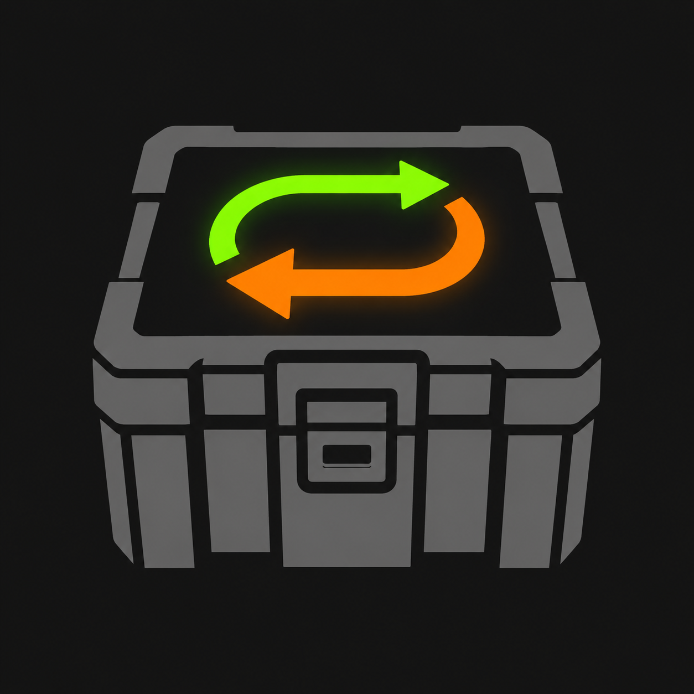

<div align="center">

#  Barter Path

[](https://www.python.org/)
[](https://aiogram.dev/)
[](https://github.com/aiogram/i18n)
[](https://www.sqlalchemy.org/)
[](https://www.postgresql.org/)
[](https://github.com/sqlalchemy/alembic)

An automated Stalzone barter tracker providing real-time resource calculations, discount management, and progression monitoring via official database.

</div>

## Features

- 🤖 **Interactive Bot Control** — Easy navigation via inline keyboards.
- 🎒 **Stalzone Barter Tracker** — Add crafting goals (e.g., A-545) and track your progress.
- 📊 **Dynamic Loot Logging** — Log successfully extracted resources to instantly recalculate what is left.
- 🌍 **Multi-Language Support** — Full English and Russian localization via Fluent.

## Project Structure

```text
├── logs/                             # App logs
├── migrations/                       # DB migrations (Alembic)
├── src/                              # Source code
│   ├── bot/                          # Telegram bot core (aiogram)
│   ├── db/                           # Database module
│   ├── locales/                      # Localization (en/ru)
│   ├── services/                     # External APIs & background updating
│   ├── config.py                     # Config loader
│   └── __main__.py                   # Main entry point
├── .env.example                      # Env template
├── poetry.lock                       # Frozen dependencies log
└── pyproject.toml                    # Dependencies
```

## 🐳 Quick Start with Docker

### 1. Clone the repository

```bash
git clone https://github.com/TheC0rX/barter-path.git
cd barter-path
```

### 2. Environment setup

Copy `.env.example` to `.env` and fill in the required values.

```bash
cp .env.example .env
```

### 3. Run application

```bash
docker compose up --build
```
